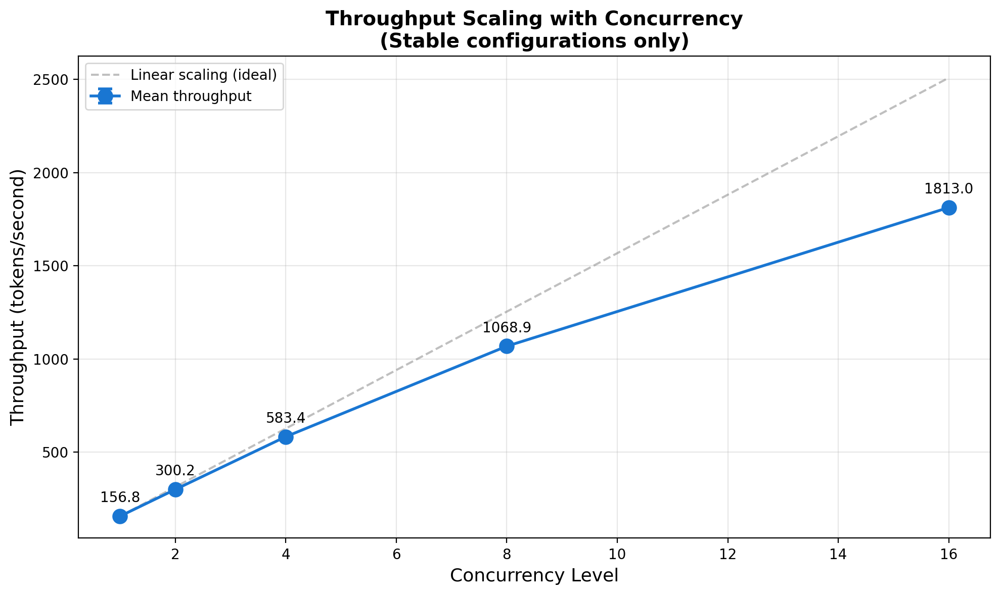

# vLLM Inference Benchmark Suite

Automated throughput and reliability testing for vLLM across GPU memory configurations and concurrency levels.

## Key Results

**90 experiments completed on GH200 96GB** (6 GPU memory settings × 5 concurrency levels × 3 seeds)



| Concurrency | Throughput (tok/s) | Scaling Efficiency |
|-------------|-------------------|-------------------|
| 1           | 157               | baseline          |
| 2           | 300               | 96%               |
| 4           | 583               | 93%               |
| 8           | 1,069             | 85%               |
| 16          | 1,813             | 72%               |

- **100% success rate** across all configurations tested
- Near-linear throughput scaling up to C=16
- Full reliability matrix: [results/option_c_20251211_052434/analysis/reliability_heatmap.png](results/option_c_20251211_052434/analysis/reliability_heatmap.png)

## Quick Start

```bash
git clone https://github.com/yourusername/vllm-benchmark.git
cd vllm-benchmark

pip install -r requirements.txt

# Verify environment (checks GPU, vLLM, dependencies)
python3 scripts/preflight_check.py

# Quick test: 2 configurations, ~15 minutes
./scripts/run_option_c.sh --quick
```

## Usage

### Run Full Benchmark Suite

```bash
# Full matrix: 90 experiments (~2 hours on GH200)
./scripts/run_option_c.sh

# Resume interrupted run
./scripts/run_option_c.sh --resume

# Dry run (show what would execute)
./scripts/run_option_c.sh --dry-run
```

### Analyze Results

```bash
# Generate plots and tables
python3 analysis/analyze_option_c.py \
    --results-dir results/option_c_20251211_052434 \
    --plots \
    --latex

# Outputs:
#   analysis/reliability_heatmap.png  - Success rate by config
#   analysis/stability_frontier.png   - Min GPU memory for reliability
#   analysis/throughput_scaling.png   - Throughput vs concurrency
#   analysis/table_reliability.tex    - LaTeX table for papers
#   analysis/report.txt               - Text summary
```

### Single Experiment

```bash
python3 scripts/benchmark_expanded.py \
    --gpu-memory 0.85 \
    --concurrency 4 \
    --seed 42 \
    --workload workload.json \
    --output results/test.csv \
    --duration 300
```

## Project Structure

```
├── scripts/
│   ├── benchmark_expanded.py   # Main benchmark script
│   ├── run_option_c.sh         # Full experiment automation
│   ├── preflight_check.py      # Environment verification
│   └── vllm_runner.py          # vLLM server wrapper
├── analysis/
│   └── analyze_option_c.py     # Results analysis and plotting
├── results/
│   └── option_c_20251211_052434/
│       ├── all_results.csv     # Combined experiment data
│       └── analysis/           # Generated plots and tables
├── workload.json               # ShareGPT test prompts
└── requirements.txt
```

## Hardware Tested

- **NVIDIA GH200 96GB** (Grace Hopper, Lambda Labs)
  - Llama-3.1-8B-Instruct
  - GPU memory: 0.70-0.95
  - Concurrency: 1, 2, 4, 8, 16

A100 40GB comparison planned.

## Requirements

- Python 3.8+
- CUDA 12.x
- NVIDIA GPU with 40GB+ memory

## License

MIT
